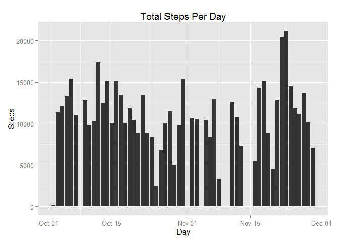
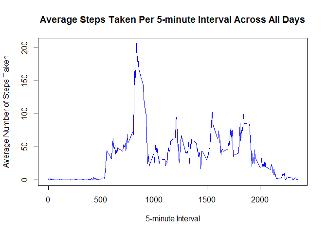
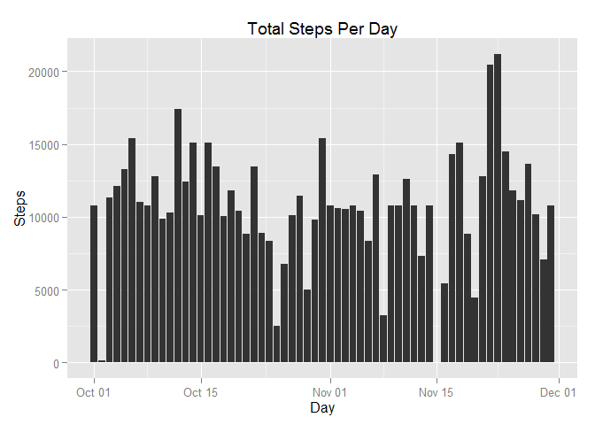
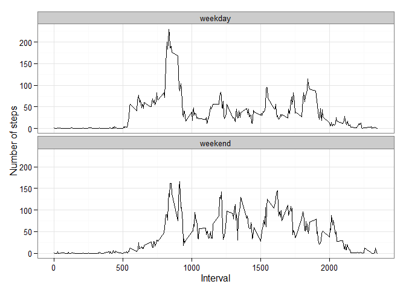

Reproducible Research -- Peer Assessment 1
=================================================================================

## Loading and preprocessing the data

### Load the data


```r
activity_data <- read.csv("activity.csv")
```

### Process/transform the data (if necessary) into a format suitable for your analysis


```r
activity_data$date <- as.Date(activity_data$date, "%m/%d/%Y")
str(activity_data)
```

```
## 'data.frame':	17568 obs. of  3 variables:
##  $ steps   : int  NA NA NA NA NA NA NA NA NA NA ...
##  $ date    : Date, format: "2012-10-01" "2012-10-01" ...
##  $ interval: int  0 5 10 15 20 25 30 35 40 45 ...
```

```r
head(activity_data)
```

```
##   steps       date interval
## 1    NA 2012-10-01        0
## 2    NA 2012-10-01        5
## 3    NA 2012-10-01       10
## 4    NA 2012-10-01       15
## 5    NA 2012-10-01       20
## 6    NA 2012-10-01       25
```

## What is mean total number of steps taken per day?

### Calculate the total number of steps taken per day


```r
StepsPerDay <- aggregate(steps ~ date, data = activity_data, sum, na.rm = TRUE)
str(StepsPerDay)
```

```
## 'data.frame':	53 obs. of  2 variables:
##  $ date : Date, format: "2012-10-02" "2012-10-03" ...
##  $ steps: int  126 11352 12116 13294 15420 11015 12811 9900 10304 17382 ...
```

```r
head(StepsPerDay)
```

```
##         date steps
## 1 2012-10-02   126
## 2 2012-10-03 11352
## 3 2012-10-04 12116
## 4 2012-10-05 13294
## 5 2012-10-06 15420
## 6 2012-10-07 11015
```

### Make a histogram of the total number of steps taken each day


```r
library(ggplot2)
p <- qplot(x = date, y = steps, data = StepsPerDay, geom = "histogram", 
        stat = "identity")
p + labs(title = "Total Steps Per Day", x = "Day", y = "Steps")
```

 

### Calculate and report the mean and median of the total number of steps taken per day

**Mean steps per day:**

```r
round(mean(StepsPerDay$steps))
```

```
## [1] 10766
```

**Median steps per day:**

```r
round(median(StepsPerDay$steps))
```

```
## [1] 10765
```

## What is the average daily activity pattern?

### Make a time series plot of the 5-minute interval and the average number of steps taken, averaged across all days


```r
time_series <- aggregate(steps ~ interval, data = activity_data, mean, na.rm = TRUE)
plot(time_series$interval, time_series$steps,
        type = "l",
        col = "blue",
        main = "Average Steps Taken Per 5-minute Interval Across All Days",
        xlab = "5-minute Interval",
        ylab = "Average Number of Steps Taken")
```

 

### Which 5-minute interval, on average across all the days in the dataset, contains the maximum number of steps?


```r
max_interval_steps <- which.max(time_series$steps)
time_series[max_interval_steps, ]
```

```
##     interval    steps
## 104      835 206.1698
```

## Imputing Missing Values

### Calculate and report the total number of missing values in the dataset (i.e. NA's)


```r
activity_data_NA <- sum(is.na(activity_data))
activity_data_NA
```

```
## [1] 2304
```

### Devise a strategy for filling in all of the missing values in the dataset

**Strategy: replace NA's with the mean for that 5-minute interval ...**


```r
new_data_fill <- activity_data
for(i in 1:nrow(new_data_fill)){
        if(is.na(new_data_fill$steps[i])){
                corresponding_interval <- new_data_fill$interval[i]
                time_series_row <- which(time_series$interval == corresponding_interval)
                new_steps <- time_series$steps[time_series_row]
                new_data_fill$steps[i] <- new_steps
        }
}
```

### Create a new dataset that is equal to the original dataset, but with the missing data filled in


```r
head(new_data_fill)
```

```
##       steps       date interval
## 1 1.7169811 2012-10-01        0
## 2 0.3396226 2012-10-01        5
## 3 0.1320755 2012-10-01       10
## 4 0.1509434 2012-10-01       15
## 5 0.0754717 2012-10-01       20
## 6 2.0943396 2012-10-01       25
```

```r
tail(new_data_fill)
```

```
##           steps       date interval
## 17563 2.6037736 2012-11-30     2330
## 17564 4.6981132 2012-11-30     2335
## 17565 3.3018868 2012-11-30     2340
## 17566 0.6415094 2012-11-30     2345
## 17567 0.2264151 2012-11-30     2350
## 17568 1.0754717 2012-11-30     2355
```

### Make a histogram of the total number of steps taken each day, and calculate and report the mean and medial total number of steps taken per day


```r
New_StepsPerDay <- aggregate(steps ~ date, data = new_data_fill, sum, na.rm = TRUE)
str(New_StepsPerDay)
```

```
## 'data.frame':	61 obs. of  2 variables:
##  $ date : Date, format: "2012-10-01" "2012-10-02" ...
##  $ steps: num  10766 126 11352 12116 13294 ...
```

```r
head(New_StepsPerDay)
```

```
##         date    steps
## 1 2012-10-01 10766.19
## 2 2012-10-02   126.00
## 3 2012-10-03 11352.00
## 4 2012-10-04 12116.00
## 5 2012-10-05 13294.00
## 6 2012-10-06 15420.00
```

```r
p2 <- qplot(x = date, y = steps, data = New_StepsPerDay, geom = "histogram", 
           stat = "identity")
p2 + labs(title = "Total Steps Per Day", x = "Day", y = "Steps")
```

 

**Mean steps per day:**

```r
round(mean(New_StepsPerDay$steps))
```

```
## [1] 10766
```

**Median steps per day:**

```r
round(median(New_StepsPerDay$steps))
```

```
## [1] 10766
```

### Do these values differ from the estimates from the first part of the assignment?

**Answer: not significantly**

### What is the impact of imputing missing data on the estimates of the total daily number of steps?

**Answer: the mean is the same, but there is a slight change in the median**

## Are there differences in activity patterns between weekdays and weekends?

### Create a new factor variable in the dataset with two levels -- "weekday" and "weekend" indicating whether a given date is a weekday or weekend day


```r
new_data_fill$day <- weekdays(new_data_fill$date)
new_data_fill$category <- "weekday"
for (i in 1:nrow(new_data_fill)){
        if(new_data_fill$day[i] == "Saturday" | new_data_fill$day[i] == "Sunday"){
                new_data_fill$category[i] <- "weekend"
        }  
}
```

### Make a panel plot containing a time series plot of the 5-minute interval and the average number of steps taken, averaged across all weekday days or weekend days


```r
new_time_series <- aggregate(steps ~ category + interval, 
        data = new_data_fill, mean)
qplot(interval, steps, data = new_time_series, geom = "line",
        xlab = "Interval",
        ylab = "Number of steps") +
        facet_wrap(~ category, ncol = 1) +
        theme_bw()
```

 
